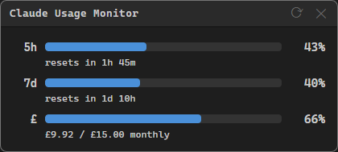

# Claude Usage Monitor

A small always-on-top desktop app for Windows 11 that shows your current Claude token usage, queried live from claude.ai.



Displays three usage metrics with colour-coded progress bars:
- 5-hour rate limit window
- 7-day usage window
- Extra credit spend (monthly)

Right-click the window to toggle Always on Top, set the refresh interval, sign out, or quit.

## Download

Grab the latest release from the [Releases](https://github.com/edward-b-1/Claude-Usage-Monitor/releases) page:

- **Claude Usage Monitor Setup x.x.x.exe** — installs the app with a Start Menu shortcut
- **Claude Usage Monitor-portable.exe** — single file, run without installing

## Getting started

### 1. Run the app

Launch the app. On first run a browser window will open asking you to sign in to claude.ai. Log in as normal — once authenticated the browser window closes automatically and the usage monitor appears.

Your session is saved, so you only need to sign in once. If your session expires the login window will reappear automatically.

### 2. That's it

Usage data loads on startup and refreshes automatically. Use the refresh button or right-click → Refresh Now to update manually.

## Right-click menu

| Option | Description |
|---|---|
| Refresh Now | Fetch latest usage immediately |
| Refresh Interval | Set auto-refresh to 30s, 1m, 5m, or 10m |
| Always on Top | Pin the window above all other windows |
| Sign Out | Clear the session and return to the login screen |
| About | Show version information |
| Quit | Close the app |

## Building from source

Builds are produced automatically via GitHub Actions on every push to `main`. Releases are created when a version tag is pushed.

To build locally on Windows:

```powershell
npm install
npm run build
```

Output is written to the `dist/` folder.

## License

[GNU General Public License v3.0](LICENSE)
